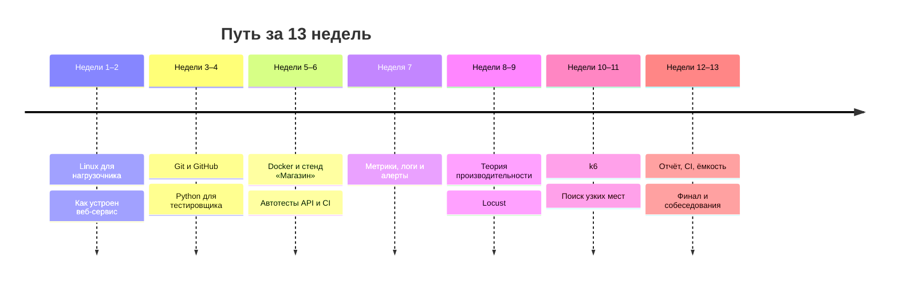

# Расписание курса

Курс рассчитан на **13 недель, 5 занятий в неделю по 1,5–2 часа**, всего 65 занятий. Одно занятие примерно равно одному уроку. Длинные уроки (3–4 часа) разбиты на два дня, а в конце крупных тем стоит день повторения.

## Как заниматься

1. **Каждый день одно занятие, в одно и то же время.** Регулярность важнее длины: пять раз по 1,5 часа дают больше, чем один раз 8 часов. Базовые вещи запоминаются, когда ты возвращаешься к ним каждый день.
2. **Начинай занятие с пяти минут повторения.** Открой «Итог урока» вчерашнего урока и ответь вслух на два вопроса с собеседований из него, не подглядывая.
3. **Практику делай руками**, даже если кажется, что всё понятно из текста. Команды набирай, а не копируй, хотя бы первые недели.
4. **Не успел за занятие: это нормально.** Доделай на следующий день и сдвинь план. День повторения в конце темы как раз запас на такие сдвиги.
5. **Застрял больше чем на 20 минут:** перечитай раздел «Типичные ошибки», затем спроси нейросеть-преподавателя из [гайда](index.html#start) и покажи ей точный текст ошибки.

## День повторения

В конце крупных тем стоит отдельный день. Его порядок всегда одинаковый:

- 30 минут: вопросы с собеседований всех уроков темы **вслух и на время**, по 1–2 минуты на ответ. Вопросы, где запнулся, выпиши.
- 40 минут: повтори практику, которая далась тяжелее всего, с чистого листа, без подсказок.
- 20 минут: по выписанным вопросам перечитай теорию и ответь ещё раз.

Отвечать вслух важно: на собеседовании знание, которое ни разу не проговаривал, от волнения «пропадает». Проговорённое остаётся.

## План по дням

| Неделя | Пн | Вт | Ср | Чт | Пт |
|---|---|---|---|---|---|
| 1 | [1.1](01-linux/01-workstation-terminal.md) | [1.2](01-linux/02-text-logs.md) | [1.3](01-linux/03-processes-resources.md) | [1.4](01-linux/04-network-cli.md), ч. 1 | [1.4](01-linux/04-network-cli.md), ч. 2 |
| 2 | [1.5](01-linux/05-bash-scripts.md) | [2.1](02-web/01-client-server-http.md) | [2.2](02-web/02-rest-json-auth.md) | [2.3](02-web/03-backend-anatomy.md) | [2.4](02-web/04-sql-basics.md) |
| 3 | [3.1](03-git/01-git-basics.md) | [3.2](03-git/02-github.md) | [4.1](04-python/01-first-program.md) | [4.2](04-python/02-conditions-loops.md) | [4.3](04-python/03-functions-errors.md) |
| 4 | [4.4](04-python/04-files-json-csv.md) | [4.5](04-python/05-venv-requests.md) | [4.6](04-python/06-classes.md) | [4.7](04-python/07-pytest.md) | Повторение тем 1–4 |
| 5 | [5.1](05-docker/01-containers.md) | [5.2](05-docker/02-dockerfile.md) | [5.3](05-docker/03-compose-shop.md) | [5.4](05-docker/04-limits-stats.md) | [6.1](06-api-testing/01-testing-basics.md) |
| 6 | [6.2](06-api-testing/02-api-autotests.md) | [6.3](06-api-testing/03-ci-actions.md) | [7.1](07-observability/01-metrics-prometheus.md) | [7.2](07-observability/02-promql.md), ч. 1 | [7.2](07-observability/02-promql.md), ч. 2 |
| 7 | [7.3](07-observability/03-grafana.md) | [7.4](07-observability/04-exporters.md) | [7.5](07-observability/05-logs-loki.md) | [7.6](07-observability/06-alerts-incidents.md) | Повторение тем 5–7 |
| 8 | [8.1](08-perf-theory/01-latency-throughput.md) | [8.2](08-perf-theory/02-queues-littles-law.md) | [8.3](08-perf-theory/03-test-types.md) | [8.4](08-perf-theory/04-load-profile-slo.md) | [9.1](09-locust/01-first-locustfile.md) |
| 9 | [9.2](09-locust/02-user-journey.md) | [9.3](09-locust/03-data-checks.md) | [9.4](09-locust/04-headless-shape.md) | [9.5](09-locust/05-distributed-generator.md) | Повторение тем 8–9 |
| 10 | [10.1](10-k6/01-js-first-script.md) | [10.2](10-k6/02-scenarios-thresholds.md) | [10.3](10-k6/03-k6-prometheus.md) | [11.1](11-bottlenecks/01-method.md) | [11.2](11-bottlenecks/02-cpu.md) |
| 11 | [11.3](11-bottlenecks/03-database.md), ч. 1 | [11.3](11-bottlenecks/03-database.md), ч. 2 | [11.4](11-bottlenecks/04-memory-soak.md) | [11.5](11-bottlenecks/05-cache-dependencies.md) | Повторение тем 10–11 |
| 12 | [12.1](12-process/01-report.md) | [12.2](12-process/02-perf-ci.md) | [12.3](12-process/03-capacity.md) | [13.1](13-final/01-incident-under-load.md) | [13.2](13-final/02-take-home.md), ч. 1 |
| 13 | [13.2](13-final/02-take-home.md), ч. 2 | [13.3](13-final/03-portfolio-resume.md) | [13.4](13-final/04-mock-perf.md) | [13.5](13-final/05-mock-monitoring.md) | Итоговое повторение всего курса |

Урок на 2,5 часа иногда занимает полтора занятия. Тогда доделай его на следующий день, а запас возьми из ближайшего дня повторения.

## Контрольные точки

После каждой точки проверь себя: если хоть один пункт не получается без подсказки, вернись к уроку, прежде чем идти дальше.

| Конец недели | Что ты должен уметь сам |
|---|---|
| 2 | Найти, чем занят процессор и память машины, проверить DNS через `dig`, сделать запрос `curl -i` и прочитать каждую строку ответа |
| 4 | Написать на Python скрипт, который логинится в API и сохраняет ответ в файл, и тест на pytest для него |
| 6 | Поднять «Магазин» одной командой и прогнать свои автотесты API в GitHub Actions |
| 7 | Построить в Grafana график RPS, доли ошибок и p95 по запросам «Магазина» и объяснить, откуда берутся числа |
| 9 | Написать сценарий покупателя в Locust, запустить по профилю нагрузки и объяснить результат по метрикам |
| 11 | Найти узкое место «Магазина» по метрикам, доказать причину и показать эффект исправления графиком «до и после» |
| 13 | Сделать тестовое задание за один день и пройти пробное собеседование, отвечая вслух |
