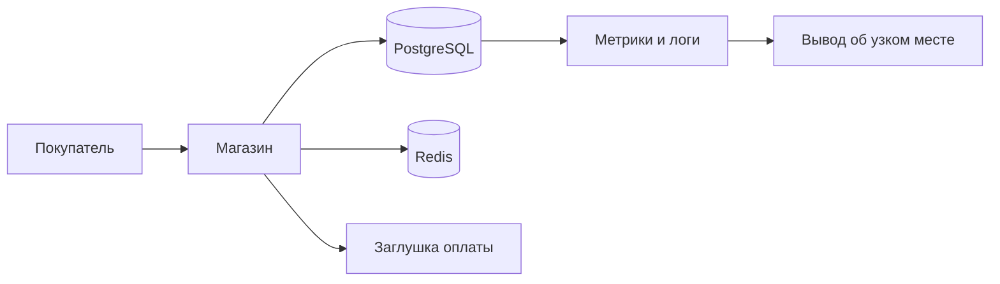
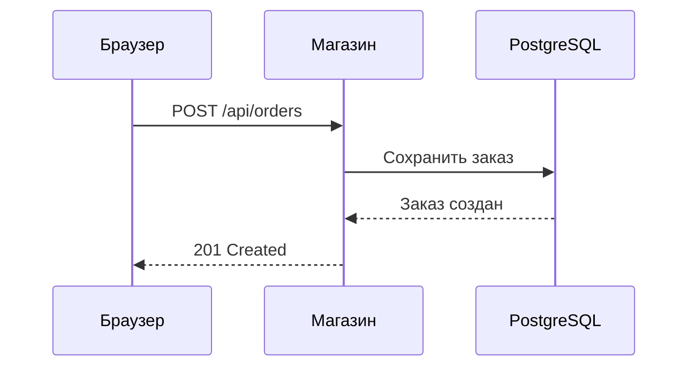

# Проверка визуальных объяснений

Это демонстрация для авторов уроков. Переключи тему оформления, проверь узкое окно и настройку «уменьшить движение». Данные и задержки здесь синтетические. Каждый виджет сам начинает с заданных значений, под ним есть блок «Что сейчас происходит» и строка «Попробуй».

Атрибуты со списками (`data-x`, `data-only`) пишутся через запятую. `data-series` и `data-steps` содержат JSON в одинарных кавычках, апострофов внутри быть не должно. Время задаётся в миллисекундах, если не сказано иное.

## Путь запроса

Атрибуты: `data-net` (мс сети в одну сторону), `data-app` (мс работы магазина), `data-db` (мс базы).

## Очередь у кассы

Атрибуты: `data-servers` (число касс, 1–6), `data-rate` (покупателей в минуту), `data-service` (секунд на одного покупателя).

## Перцентили

Атрибуты: `data-slow` (сколько из 100 запросов тормозят, 0–30), `data-slow-ms` (сколько длится тормозящий запрос, 200–3000). Старое имя `latency-hist` работает как псевдоним.

## Запас до предела

Атрибуты: `data-capacity` (предел, запросов в секунду), `data-base` (мс работы без очереди), `data-load` (стартовая нагрузка), `data-unit` (единица нагрузки).

## Профили нагрузки

Без атрибутов показаны все профили:

`data-only` оставляет только нужные:

## Пул соединений

Атрибуты: `data-size` (размер пула), `data-duration` (мс на один запрос), `data-rate` (запросов в секунду), `data-timeout` (мс ожидания свободного слота).

## Линейный график

Атрибуты: `data-type`, `data-x`, `data-series` (JSON, у серии можно задать свой `"unit"`), `data-x-label`, `data-y-label`, `data-unit`, `data-title`, `data-explain` (текст под графиком). Наведение на точку показывает значение, клик по легенде скрывает серию.

## Столбчатый график

## Алгоритм диагностики

`data-steps`: массив строк или объектов `{"title": "коротко", "text": "подробности"}`. Обратные кавычки в тексте становятся кодом.

## Mermaid: путь запроса

Блок с языком `mermaid` лениво загружает библиотеку. Без таких блоков библиотека не запрашивается.

## Mermaid: последовательность

## Виджеты тем

Эти виджеты лежат в `assets/js/viz/<папка-темы>.js` и подключаются на всех страницах автоматически.

### Тема 1: Linux

Конвейер команд:

Load average и ядра (`data-cores`, `data-load`):

Из чего складывается время запроса (`data-dns`, `data-rtt`, `data-server` в мс):

### Тема 2: как устроен веб-сервис

Обмен запросом и ответом (`data-set`: `http`, `auth` или `all`):

Поиск с индексом и без (`data-rows`: строк в таблице, `data-matches`: подходящих):

### Тема 4: Python

Пошаговое выполнение кода (`data-code`: JSON-массив строк, `data-steps`: JSON `[{l,v,o,n,f}]`, рабочие примеры в уроках 4.2 и 4.4). Индексы и срезы:

Новое соединение на каждый запрос против Session (`data-requests`, `data-connect`, `data-work` в мс):

Веса задач (`data-users`, `data-weights` в JSON):

### Тема 5: Docker

Жизненный цикл контейнера (`data-image`, `data-name`, `data-volume`):

Слои и кэш сборки (`data-change`: `none`, `app`, `requirements` или `base`; `data-order`: `good` или `bad`):

Порядок запуска и healthcheck (`data-seed`, `data-condition`):

Лимиты CPU и памяти (`data-rps`, `data-cpus`, `data-mem`, `data-leak`, `data-restart`):

### Тема 6: автотесты API

Граничные значения параметра (`data-param`: `size` или `page`, `data-value`):

Пирамида тестов (`data-unit`, `data-api`, `data-ui`):

Отчёт pytest о падении (`data-fail`: `ok`, `limit`, `auth`, `schema` или `order`):

Тесты в CI (`data-fail`: `ok`, `stand`, `test` или `yaml`):

### Тема 7: метрики и Prometheus

Сбор метрик (`data-interval`: секунд между опросами):

Счётчик и `rate` (`data-window`: окно в секундах):

Перцентиль по бакетам гистограммы (`data-slow`: медленных из 100, `data-q`: перцентиль):

Дашборд RED во время теста (`data-scenario`: `ok`, `pool` или `payment`):

Метод USE на графиках стенда (`data-scenario`: `idle`, `bcrypt`, `leak`, `payment` или `index`):

Запрос к логам (`data-preset`: `all` или `errors`):

Жизнь алерта (`data-threshold` в %, `data-for` в секундах):

### Тема 8: теория производительности

Закон Литтла в кафе (`data-rate`: гостей в минуту, `data-time`: секунд на гостя, `data-place`):

Открытая и закрытая модели нагрузки (`data-rate`, `data-users`, `data-slow`):

Из сессий в запросы в секунду (числа `data-sessions`, `data-peak`, `data-growth`; `data-ops` и `data-limit` в JSON):

### Тема 9: Locust

Закрытая модель: пользователи и пауза (`data-users`, `data-wait-min`, `data-wait-max` в секундах, `data-resp` в мс, `data-cap` RPS):

Предел генератора (`data-gen` RPS на процесс, `data-procs`, `data-server`):

Координированное упущение (`data-rate`, `data-stall` в секундах):

### Тема 10: k6

Виртуальные пользователи и итерации (`data-vus`, `data-latency` в мс, `data-sleep` в секундах):

Исполнители k6 (`data-rate`, `data-vus`, `data-maxvus`, `data-latency`, `data-slow`):

Пороги (`data-limit` в мс, `data-errors` в %, `data-slowpct` в %):

Что выбрать, k6 или Locust:

### Тема 11: узкие места

Дерево диагностики (`data-case` от 1 до 6):

Цена bcrypt (`data-rounds`, `data-cpus`):

Индекс, N+1 и пул (`data-index`, `data-fixed`, `data-pool`, `data-load`):

Утечка памяти (`data-rps`, `data-kb` на запрос, `data-limit` и `data-base` в МБ):

Шторм ретраев (`data-rate`, `data-capacity`, `data-retries`, `data-timeout`, `data-blip`):

### Тема 12: процесс

История прогонов в CI и регресс (`data-base`, `data-noise`, `data-regress`, `data-at`, `data-threshold`, `data-retries`):

Прогноз ёмкости (`data-peak`, `data-capacity`, `data-growth` в % в месяц, `data-target`, `data-season`, `data-season-month`, `data-boost`):

### Тема 13: финал

Хронология инцидента (`data-delay` в мс, `data-react` в минутах):

План дня для тестового задания (`data-total` часов, `data-plan` в JSON):

Тренажёр вопросов на скорость (`data-seconds`, `data-questions` в JSON):

