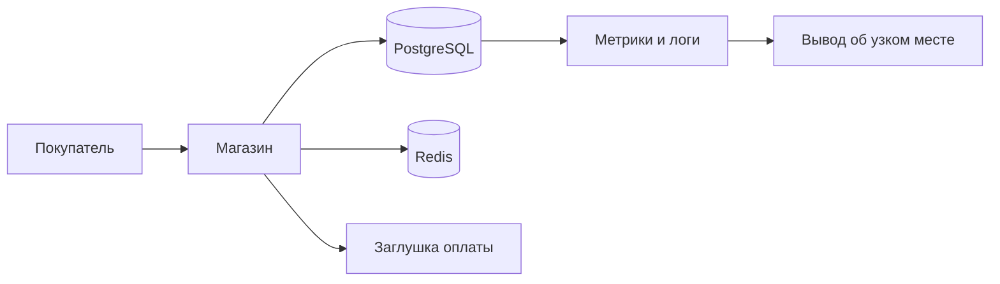
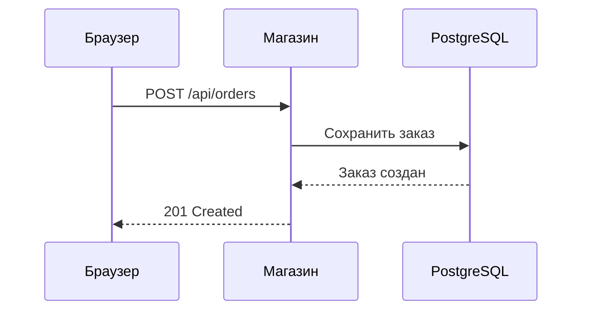

# Проверка визуальных объяснений

Это демонстрация для авторов уроков. Переключи тему оформления, проверь узкое окно и настройку «уменьшить движение». Данные и задержки здесь синтетические. Анимация начинается кнопкой «Пуск».

Разметку примеров можно взять из исходника этой страницы. Атрибуты `data-nodes`, `data-ms`, `data-x`, `data-only` содержат значения через запятую. `data-series` и `data-steps` содержат JSON. Время в `data-ms` и `data-timeout` задаётся в миллисекундах.

## Путь запроса

## Очередь

При λ близкой к μ ожидание растёт. При λ ≥ μ устойчивая очередь невозможна. Закон Литтла связывает среднее число заявок, скорость поступления и время в системе: L = λW. Для очереди отдельно: Lq = λWq. Здесь μ задаёт ёмкость всех каналов вместе, а счётчик показывает ожидание до начала обслуживания.

## Длинный хвост задержек

Двигай ползунок на одной и той же выборке, чтобы сравнить среднее и перцентили. «Новая выборка» заново создаёт 1200 запросов.

## Запас до предела

## Профили нагрузки

Можно оставить только нужные профили:

## Пул соединений

`data-rate` задаёт интенсивность поступления, `data-timeout` задаёт таймаут ожидания свободного слота.

## Линейный график

Наведение, касание и клавиши стрелок показывают точные значения. Под графиком есть доступная таблица данных.

## Столбчатый график

## Алгоритм диагностики

## Mermaid: путь запроса

Блок с языком `mermaid` лениво загружает библиотеку. Без таких блоков библиотека не запрашивается.

## Mermaid: последовательность

