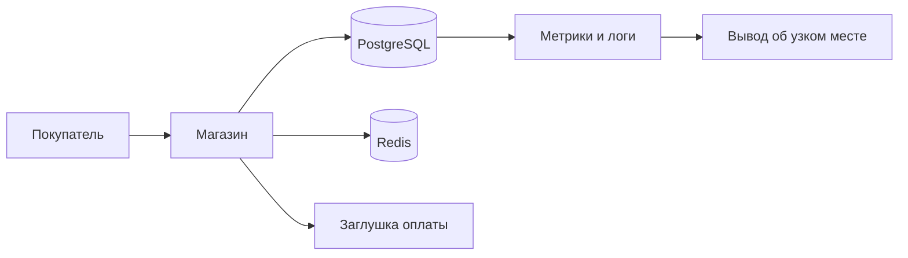
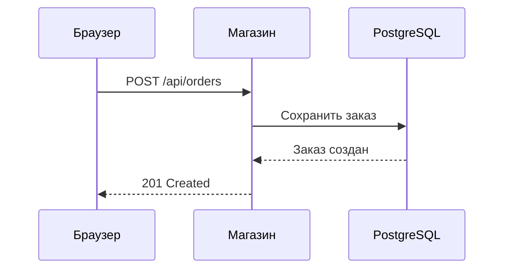

# Проверка визуальных объяснений

Это демонстрация для авторов уроков. Переключи тему оформления, проверь узкое окно и настройку «уменьшить движение». Данные и задержки здесь синтетические. Каждый виджет сам начинает с заданных значений, под ним есть блок «Что сейчас происходит» и строка «Попробуй».

Атрибуты со списками (`data-x`, `data-only`) пишутся через запятую. `data-series` и `data-steps` содержат JSON в одинарных кавычках, апострофов внутри быть не должно. Время задаётся в миллисекундах, если не сказано иное.

## Путь запроса

Атрибуты: `data-net` (мс сети в одну сторону), `data-app` (мс работы магазина), `data-db` (мс базы).

## Очередь у кассы

Атрибуты: `data-servers` (число касс, 1–6), `data-rate` (покупателей в минуту), `data-service` (секунд на одного покупателя).

## Перцентили

Атрибуты: `data-slow` (сколько из 100 запросов тормозят, 0–30), `data-slow-ms` (сколько длится тормозящий запрос, 200–3000). Старое имя `latency-hist` работает как псевдоним.

## Запас до предела

Атрибуты: `data-capacity` (предел, запросов в секунду), `data-base` (мс работы без очереди), `data-load` (стартовая нагрузка), `data-unit` (единица нагрузки).

## Профили нагрузки

Без атрибутов показаны все профили:

`data-only` оставляет только нужные:

## Пул соединений

Атрибуты: `data-size` (размер пула), `data-duration` (мс на один запрос), `data-rate` (запросов в секунду), `data-timeout` (мс ожидания свободного слота).

## Линейный график

Атрибуты: `data-type`, `data-x`, `data-series` (JSON, у серии можно задать свой `"unit"`), `data-x-label`, `data-y-label`, `data-unit`, `data-title`, `data-explain` (текст под графиком). Наведение на точку показывает значение, клик по легенде скрывает серию.

## Столбчатый график

## Алгоритм диагностики

`data-steps`: массив строк или объектов `{"title": "коротко", "text": "подробности"}`. Обратные кавычки в тексте становятся кодом.

## Mermaid: путь запроса

Блок с языком `mermaid` лениво загружает библиотеку. Без таких блоков библиотека не запрашивается.

## Mermaid: последовательность

